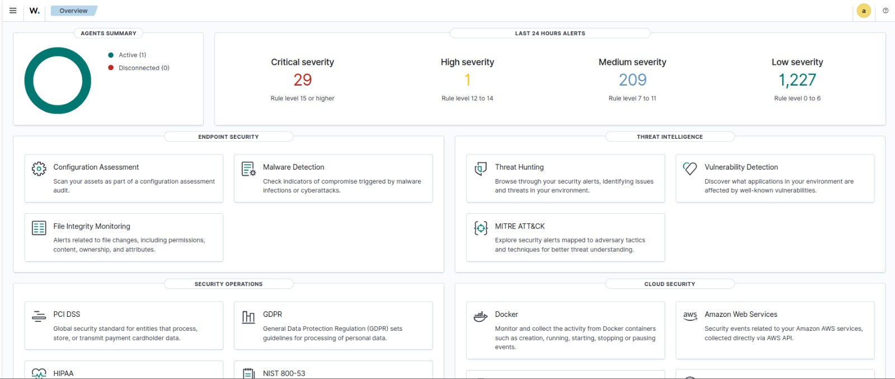
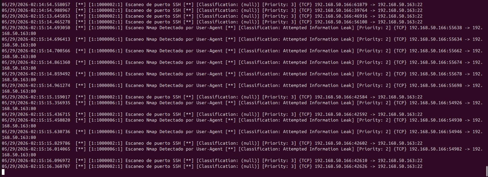
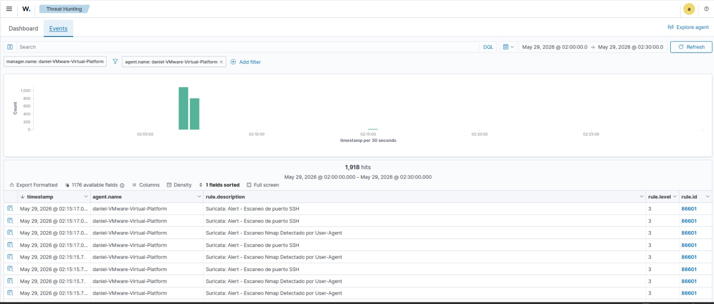
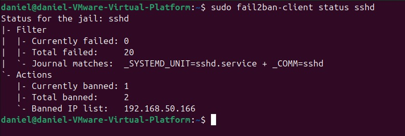
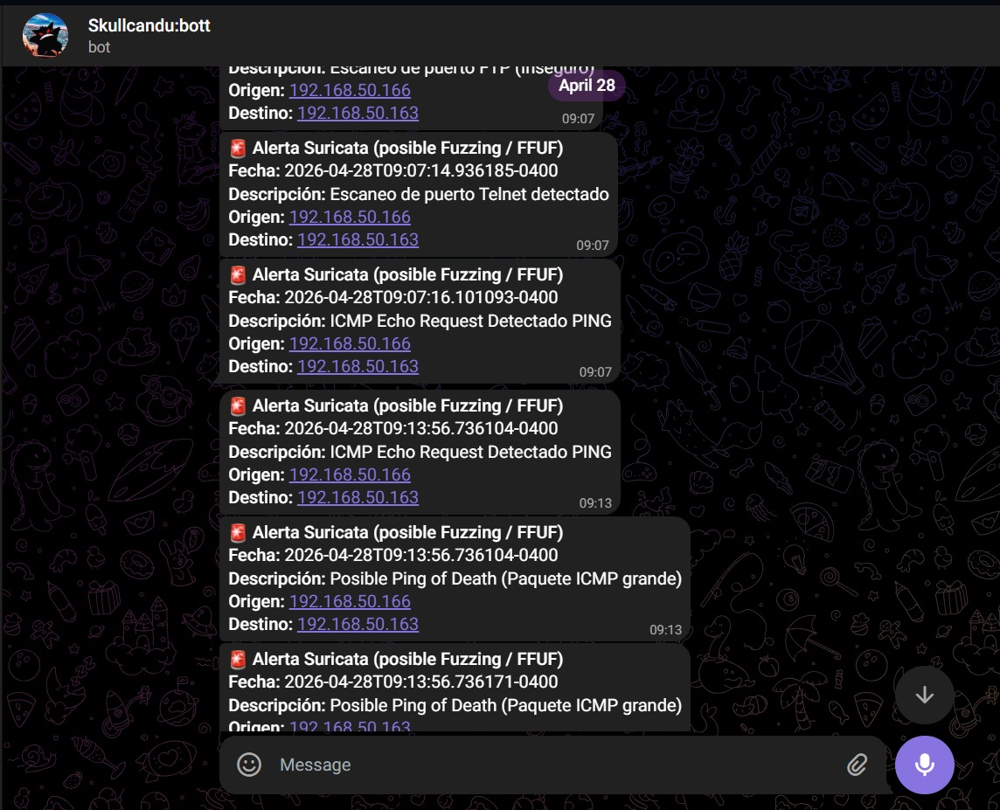

# 🛡️ Laboratorio de Operaciones de Seguridad (SOC) y Monitoreo Defensivo

## 🎯 Objetivo del Proyecto
Implementación de una arquitectura de seguridad defensiva en un entorno de laboratorio para la detección, gestión y mitigación automatizada de amenazas en la red. 



## 🗺️ Topología de Red y Arquitectura del Laboratorio

El entorno fue diseñado simulando una red corporativa segmentada, utilizando máquinas virtuales independientes para representar cada rol dentro del ciclo de ataque, detección y respuesta:

* **💻 Windows Server (Entorno Víctima):**
  * Actúa como el servidor objetivo en la red.
  * Configurado con **Sysmon** (System Monitor) para la captura avanzada de telemetría y eventos del sistema.
  * Cuenta con el **Agente de Wazuh** para la recolección y reenvío seguro de logs hacia el SIEM.

* **🛡️ Ubuntu Linux (Centro de Operaciones y Defensa):**
  * Funciona como el núcleo defensivo de la infraestructura.
  * Aloja el **Wazuh Manager** para la correlación y análisis de los eventos recibidos.
  * Ejecuta **Suricata** monitoreando el tráfico de red y **Fail2Ban** para ejecutar la respuesta activa y bloqueos en el firewall.

* **⚔️ Kali Linux (Entorno Atacante / Red Team):**
  * Máquina adversaria utilizada para lanzar simulaciones de ataque (escaneos con Nmap, fuerza bruta, explotación con Metasploit) y generar la telemetría maliciosa que pone a prueba las reglas del SOC.

* **🔍 OpenVAS (Gestión de Vulnerabilidades):**
  * Desplegado en una máquina virtual independiente para ejecutar análisis de vulnerabilidades y auditorías preventivas sobre los nodos de la red.

## ⚙️ Configuración y Despliegue

Para garantizar la estabilidad del entorno, los servicios de monitoreo y detección se ejecutan como demonios en el servidor Ubuntu. A continuación, se detallan los comandos de validación de los servicios core:

```bash
# Verificación de estado del SIEM y el IDS
sudo systemctl status wazuh-manager
sudo systemctl status suricata
sudo systemctl status fail2ban
```
### 1. Detección en Suricata (IDS)
Se configuraron reglas personalizadas en `/etc/suricata/rules/local.rules` para detectar desde escaneos básicos hasta vulnerabilidades a nivel de aplicación (OWASP Top 10).
> 📁 *Puedes revisar mi set de reglas completo (SQLi, XSS, DoS, Path Traversal) en la carpeta [`configs/suricata_local.rules`](./configs/suricata_local.rules)*.

**Ejemplos de reglas implementadas:**
```yaml
# Detección de herramientas de escaneo web automatizado
alert http any any -> any any (msg:"Escaneo de vulnerabilidades web con Nikto"; content:"Nikto"; http_user_agent; nocase; classtype:attempted-recon; sid:1000011; rev:1;)

# Detección de intentos de Path Traversal (LFI)
alert http any any -> any any (msg:"Intento de Path Traversal (/etc/passwd)"; content:"/etc/passwd"; http_uri; classtype:attempted-admin; sid:1000010; rev:1;)
```
### 1. Detección en Suricata (IDS)
Se configuraron reglas personalizadas en `/etc/suricata/rules/local.rules` para detectar desde escaneos básicos hasta vulnerabilidades a nivel de aplicación (OWASP Top 10).

> 📁 *Puedes revisar mi set de reglas completo...*

**Ejemplos de reglas implementadas:**
(Aquí va tu recuadro oscuro con el código de Nikto y Path Traversal)

---

## 📊 Simulación de Ataque y Evidencia (Screenshots)

Para validar la arquitectura, se simuló un ataque de reconocimiento desde la máquina Kali Linux (Red Team) hacia la infraestructura monitoreada.

### 1. Evidencia de Detección en Logs (Suricata)
Al lanzar el escaneo, las reglas personalizadas configuradas en el IDS detectaron inmediatamente el reconocimiento mediante la inspección profunda de paquetes (DPI), registrando el ataque en el `fast.log`:



### 2. Correlación y Visualización en el SIEM (Wazuh)
Los logs generados por el IDS en la red fueron recolectados por el agente, normalizados y presentados en el módulo de *Threat Hunting* de Wazuh, permitiendo una visualización clara y estructurada del incidente de seguridad:



### 3. Respuesta Activa y Mitigación (Fail2Ban)
Al detectar la actividad maliciosa recurrente, el sistema de Prevención de Intrusiones (IPS) ejecutó la política de respuesta activa preconfigurada. La IP del atacante (`192.168.50.166`) fue baneada exitosamente a nivel de firewall mediante `iptables`, mitigando la amenaza de forma automatizada:



### 4. Alertamiento en Tiempo Real (Integración API Telegram)
Para garantizar una monitorización 24/7 y reducir los tiempos de respuesta, se implementó un script en Python que intercepta las alertas de alta prioridad del SIEM y las envía al dispositivo móvil del analista a través de la API de Telegram. La notificación incluye contexto crítico como la descripción del ataque y las direcciones IP involucradas:


